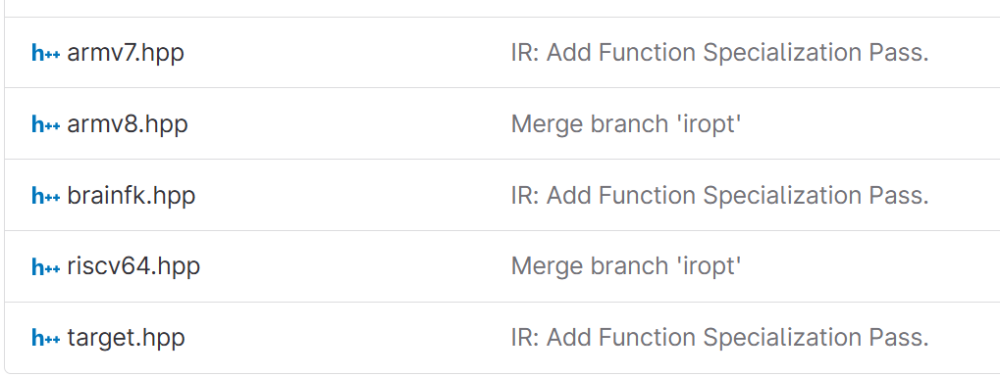
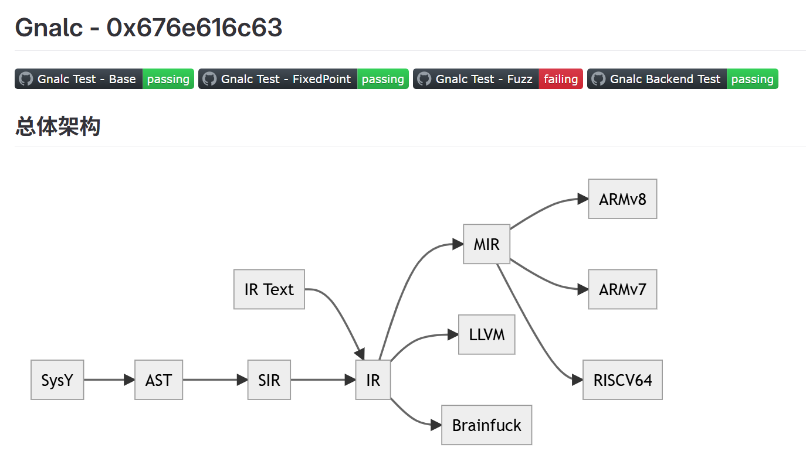
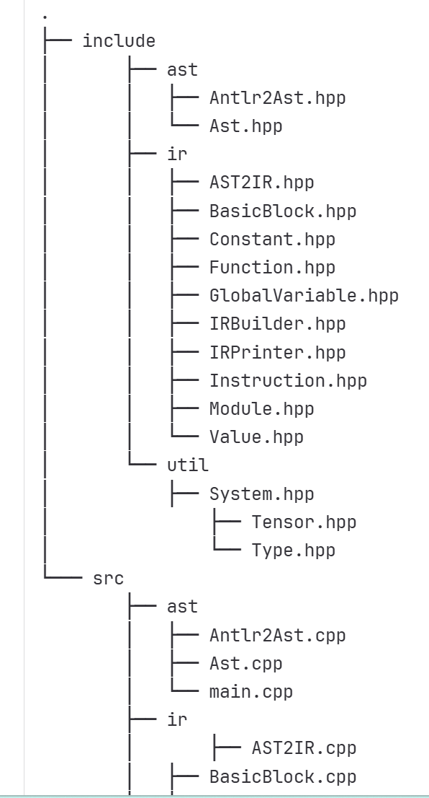

ARM赛道参赛作品开源地址
队伍ID	队伍名称	学校	fork仓库地址
T202510614205710	0x676e616c63	电子科技大学	https://gitlab.eduxiji.net/educg-group-36290-2935672/T202510614205710-2983
llvm 不要

T202510246206554	Compiler_vs_Bugs	复旦大学	https://gitlab.eduxiji.net/educg-group-36291-2935673/T202510246206554-2456
# 可以用
本项目使用C++语言，参考虎书介绍的编译器框架，实现针对SysY2022语言的编译器，整体分为讲SysY2022语言转换为我们自己设计的一种中间语言Quad的前端和将Quad转换到后端asm aarch64框架的后端。

T202500000205464	不队	剑桥大学	https://gitlab.eduxiji.net/educg-group-36290-2935672/T202500000205464-2455

c++，未知概念太多
概述
这个编译器受到了不少 MLIR 的启发。这里的 IR 就是模仿它设计的。
每个 Op 都有恰好一个返回值，不定数量的操作数（Value，对 Op* 的一层包装），一些子作用域 (Region*，实际上是基本块的容器)，以及一些属性 (Attr*)。Op 本身并不对任何东西进行检查，但 Pass 会假定某些 Op 具有特定的操作个数和属性（例如 AddIOp 有恰好两个操作数）。
这样会让 Lowering 略微方便一些：比起将它转译为某种类似 MCInst 的东西，我可以直接利用已有的 Op 设施。这就相当于 MLIR 的 dialect conversion。不过，这会导致一些后端特有的性质难以表示（见下），但当我发现这一点时已经不好修改架构了。

T202510358205721	请输入队名	中国科学技术大学	https://gitlab.eduxiji.net/educg-group-36291-2935673/T202510358205721-859

## ！ llvm
# 可以用

不同功能的组件位于不同目录。
ANTLR 词语法分析器由 ANTLR 从 EBNF 生成，置于./antlr，见 README。

util
CSY 实现了一些通用组件，以便于项目代码的构建。

System
本文件 System.hpp/cpp 独立了平台特定代码，主要是大小端代码。

T202510487205995	奶龙	华中科技大学	https://gitlab.eduxiji.net/educg-group-36291-2935673/T202510487205995-590
python不用

T202510699205760	gogogo,编译喽	西北工业大学	https://gitlab.eduxiji.net/educg-group-36291-2935673/T202510699205760-916

c++,结构简单易懂，
# 可以用

T202510284206762	打开龙书发现是奶龙	南京大学	https://gitlab.eduxiji.net/educg-group-36291-2935673/T202510284206762-3592

llvm 不是gcc

T202590002206574	Syntax干饭人	国防科技大学	https://gitlab.eduxiji.net/educg-group-36291-2935673/T202590002206574-2620

rust 不要

T202511065206072	再编译一次吧!蓝色疾旋鼬	青岛大学	https://gitlab.eduxiji.net/educg-group-36291-2935673/T202511065206072-3512

java 不要

T202590002206573	Git冲突合并大师	国防科技大学	https://gitlab.eduxiji.net/educg-group-36291-2935673/T202590002206573-3467

llvm 不要

T202510395206193	一直跑队	闽江学院	https://gitlab.eduxiji.net/educg-group-36291-2935673/T202510395206193-3284

llvm 不要

T202510358205752	一个水瓶	中国科学技术大学	https://gitlab.eduxiji.net/educg-group-36291-2935673/T202510358205752-2020

llvm 不要

T202510006206054	欧姆定律	北京航空航天大学	https://gitlab.eduxiji.net/educg-group-36290-2935672/T202510006206054-131

不要

T202510006206029	RealARM	北京航空航天大学	https://gitlab.eduxiji.net/educg-group-36291-2935673/T202510006206029-3000

java 不要

T202510027205911	意料之中的意外	北京师范大学	https://gitlab.eduxiji.net/educg-group-36291-2935673/T202510027205911-1728

没东西

T202510055206442	败走鹅城	南开大学	https://gitlab.eduxiji.net/educg-group-36291-2935673/T202510055206442-3240

可以试试，不做优先选项

T202510614205974	Medi-Inside-Out	电子科技大学	https://gitlab.eduxiji.net/educg-group-36291-2935673/T202510614205974-2563

rs 不要 使用 Rust 编写的类 LLVM 中间代码系统, 主要为编译器竞赛服务.
只能说这玩意除了思想和 LLVM-IR 沾点边外, 从头到尾一点都不像 LLVM.