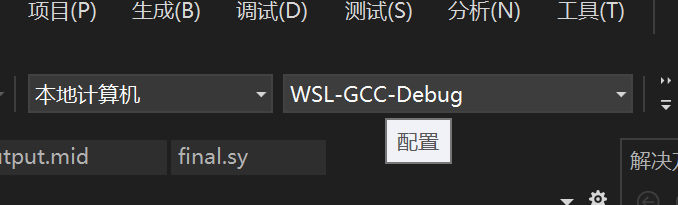
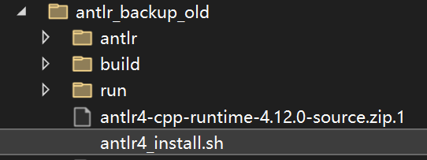

#  SysY编译器项目移植

##  **一、核心依赖项**

### **A. 系统级依赖（Ubuntu/WSL）**
```bash
# 必须安装的基础工具
sudo apt update
sudo apt install -y build-essential cmake git unzip wget
sudo apt install -y default-jre  # ANTLR需要Java运行时

# ARM交叉编译器（用于生成ARM代码）
sudo apt install -y gcc-aarch64-linux-gnu g++-aarch64-linux-gnu binutils-aarch64-linux-gnu

```

### **B. ANTLR4 依赖（最关键！）**
```bash
# 1. ANTLR4 C++运行时库（4.12.0版本）
wget https://www.antlr.org/download/antlr4-cpp-runtime-4.12.0-source.zip
unzip antlr4-cpp-runtime-4.12.0-source.zip
cd antlr4-cpp-runtime-4.12.0
mkdir build && cd build
cmake .. -DCMAKE_BUILD_TYPE=Release
sudo make install
sudo ldconfig

# 2. ANTLR4 工具（用于生成解析器代码）
wget https://www.antlr.org/download/antlr-4.12.0-complete.jar
# 使用时：java -jar antlr-4.12.0-complete.jar -Dlanguage=Cpp -visitor -o antlr antlr/SysY.g4
```

### **C. 项目特定文件**
```
项目根目录/
├── lib/
│   ├── sylib.h1      # SysY运行时库头文件
│   └── sylib.c1      # SysY运行时库实现）
├── antlr/          # ANTLR 词语法分析器由 ANTLR 从 EBNF 生成，置于./antlr，见 README。
│   ├── SysY.g4       # 语法定义文件
│   └── README.md     # ANTLR生成说明
└── tests/
    └── astTest.sh    # AST测试脚本
```
```
完整目录结构
├── include
│	├── ast
│	│   ├── Antlr2Ast.hpp
│	│   └── Ast.hpp
│	├── ir
│	│   ├── AST2IR.hpp
│	│   ├── BasicBlock.hpp
│	│   ├── Constant.hpp
│	│   ├── Function.hpp
│	│   ├── GlobalVariable.hpp
│	│   ├── IRBuilder.hpp
│	│   ├── IRPrinter.hpp
│	│   ├── Instruction.hpp
│	│   ├── Module.hpp
│	│   └── Value.hpp
│	└── util
│	    ├── System.hpp
│		├── Tensor.hpp
│		└── Type.hpp
└─── src
	├── ast
	│   ├── Antlr2Ast.cpp
	│   ├── Ast.cpp
	│   └── main.cpp
	├── ir
	│  	├── AST2IR.cpp
	│   ├── BasicBlock.cpp
	│   ├── Constant.cpp
	│   ├── Function.cpp
	│   ├── GlobalVariable.cpp
	│   ├── IRPrinter.cpp
	│   ├── Instruction.cpp
	│   ├── Module.cpp
	│   ├── Value.cpp
	│   └── main.cpp
	├── main.cpp
	└── util
	    ├── System.cpp
	    ├── Tensor.cpp
	    └── Type.cpp

```
##  **二、项目结构分析**

### **关键目录说明**
```bash
# 源代码组织
include/           # 头文件目录
├── ast/          # 抽象语法树相关
├── ir/           # 中间表示相关
├── codegen/      # 代码生成
├── passes/       # 优化通道
├── machineir/    # 机器IR
└── util/         # 工具类

src/              # 源文件目录（与include对应）
antlr/            # ANTLR生成的解析器代码
build/            # 构建目录（CMake生成）
tests/            # 测试文件
lib/              # SysY运行时库

```

### **构建系统识别方法**

 本项目的构建系统：
 1. 主构建：CMake（CMakeLists.txt）在根目录
 2. 备选：传统Makefile（用于简单编译）
 3. 后加Makefile-parallel：为了提高运行速度，自己新加的并行运行makefile脚本 在根目录


##  **三、路径配置与修改清单**

### **A. 绝对路径 → 相对路径修复**
```bash
# 问题脚本：tests/astTest.sh
运行目录是"项目根目录/tests"
# 原内容（有问题）：
../build/compiler -S -o "$mid_file" "$source_file" -ast
aarch64-linux-gnu-g++ -x c++ "$mid_file" -include lib/sylib.h1 -L build/lib -l:sylib++.a -o "$target_file"

# 修正后（正确）：
../build/compiler -S -o "$mid_file" "$source_file" -ast
aarch64-linux-gnu-g++ -x c++ "$mid_file" -include ../lib/sylib.h1 -L ../build/lib -l:sylib++.a -o "$target_file"
#                     ↑ 添加../          ↑ 添加../
```

### **B. 文件扩展名修正**
```bash
# 注意：项目使用非标准扩展名
lib/sylib.h1   
lib/sylib.c1    

# 编译时需要指定语言
aarch64-linux-gnu-gcc -x c -c lib/sylib.c1 -o build/lib/sylib.o
#                ↑ 明确指定为C语言
```

### **C. 环境变量设置**
```bash
# 在~/.bashrc或测试脚本中添加
export ANTLR4_RUNTIME=/usr/local/lib
export LD_LIBRARY_PATH=/usr/local/lib:$LD_LIBRARY_PATH
export PATH=/usr/local/bin:$PATH

# 用于CMake查找ANTLR
export CMAKE_PREFIX_PATH=/usr/local
```

##  **四、构建系统选择与配置**

### **构建方法对比**
| 方法 | 命令 | 适用场景 | 注意 |
|------|------|----------|------|
| **CMake（推荐）** | `mkdir build && cd build && cmake .. && make` | 标准构建，支持多种配置 | 需要正确配置ANTLR路径 |
| **传统Makefile** | `make CXX=g++ -j4` | 快速简单构建 | 路径硬编码，移植性差 |
| **直接编译** | `g++ -std=c++17 ...` | 调试或快速测试 | 需要手动列出所有文件 |

### **CMake文件解读**
```cmake
# CMakeLists.txt：
# 1. 设置ANTLR路径
set(ANTLR4_RUNTIME_DIR "/usr/local")
include_directories(${ANTLR4_RUNTIME_DIR}/include)

# 2. 链接ANTLR库
find_library(ANTLR4_LIB NAMES antlr4-runtime PATHS ${ANTLR4_RUNTIME_DIR}/lib REQUIRED)
target_link_libraries(compiler ${ANTLR4_LIB})

# 3. 设置C++标准
set(CMAKE_CXX_STANDARD 17)
set(CMAKE_CXX_STANDARD_REQUIRED ON)
```

##  **五、移植到新系统的步骤**

### **步骤1：环境检查**
```bash
# 1. 检查基本工具
which cmake gcc g++ java unzip wget

# 2. 检查ANTLR
find /usr -name "*antlr4*" 2>/dev/null | head -5
find /usr/local -name "*antlr4*" 2>/dev/null | head -5

# 3. 检查交叉编译器
which aarch64-linux-gnu-gcc
aarch64-linux-gnu-gcc --version
```
4. 软件选择
对于这个SysY编译器项目，选择VS 2022还是VSCode主要取决于你的个人偏好和项目需求。下面是具体对比：

|特性 |	Visual Studio 2022 (推荐)	| Visual Studio Code|
|-----|----------------------------|------------------|
|适合人群 |	偏好开箱即用、强集成环境	| 偏好高度自定义、轻量灵活|
|C++支持 |	原生顶级支持，包含完整MSVC编译器、调试器、CMake集成 |	需手动安装扩展（MSVC或MinGW）、配置调试和智能感知|
|CMake支持 |	深度集成，可一键打开、配置、构建CMake项目 |	需安装“CMake Tools”扩展，配置相对复杂|
|调试体验 |	极其强大且简单，图形化界面，无需配置 |	功能强大但需手动配置launch.json|
|项目复杂度 |	更适合中大型、依赖复杂的原生C++项目 |	更适合轻量级或跨平台项目|
|配置难度 |	极低，安装时勾选“C++桌面开发”即可 |	中高，需自行组合扩展和配置环境变量|
|

强烈推荐使用 VS 2022
这是最省心、成功率最高的方案。项目本身是Windows原生C++项目，依赖ANTLR。VS 2022的MSVC编译器能提供最好的兼容性。

在VS 2022中的操作步骤：

安装时务必勾选 “使用C++的桌面开发” 和 “用于Windows的C++ CMake工具”。

打开VS 2022，选择 “打开本地文件夹”，直接指向项目根目录（包含CMakeLists.txt的文件夹）。

VS 2022会自动识别为CMake项目并开始配置。在顶部菜单栏可以选择生成配置（如x64-Debug）。

按F5即可一键编译并调试。


### **步骤2：项目配置**

当出现“需要Linux”类似提示时，按照提示安装此扩展；

第一步：在WSL2（Ubuntu）中安装必要的构建工具和依赖
打开你的WSL2 Ubuntu终端。运行以下命令更新软件包列表并安装必须的编译器、构建工具和库：
```
bash
sudo apt update
sudo apt upgrade -y
sudo apt install -y build-essential cmake git
sudo apt install -y ninja-build gcc g++ cmake make
```
安装ANTLR4 C++运行时。这是项目文件明确指出的核心依赖。在Ubuntu终端中执行：
```
bash
sudo apt install -y antlr4 libantlr4-runtime-dev pkg-config
```
第二步：使用VS 2022连接到WSL并打开项目

在VS 2022的顶部菜单栏中，找到这个下拉选择框：
目标系统 或 管理连接...
（通常在工具栏靠近中间或“项目”菜单下,它很可能当前显示为 “Windows” 或 “x64”。）


这个选项的作用是：使用你默认的WSL发行版（也就是你的Ubuntu 22.04），并调用里面的GCC编译器进行调试构建。

重要：重新打开或重新加载你的项目文件夹。确保VS 2022的状态栏或输出窗口显示连接到了WSL（例如 WSL: Ubuntu）。

触发配置：右键点击 CMakeLists.txt -> “删除缓存并重新配置”。

观察输出：看“输出”面板里的CMake日志。关键看两件事：

是否成功配置（最后几行显示 CMake generation finished.）。

在配置过程中，CMake 找到了什么编译器（通常会显示一行类似 -- The C compiler identification is GNU 11.4.0 的信息）。

如果出现：CMake使用的是Windows本地的MSVC编译器（MSVC 19.44，路径是cl.exe），并且构建目录是 x64-Debug，说明没有切换成功。在VS 2022的“解决方案资源管理器”中，右键点击你的项目根目录（或 CMakeLists.txt 文件）。

选择 “删除缓存并重新配置”。
点击顶部工具栏的配置下拉菜单，再次确认选择了 WSL-GCC-Debug。

选择后，立即去“输出”面板查看。CMake应该开始重新运行。

关键验证：这次输出的第一行工作目录，必须不再是 D:\...\x64-Debug 这样的Windows路径，而应该是一个 Linux路径（如 /mnt/d/... 或 /home/...）。

检查状态栏：

配置成功后，VS 2022窗口最底部的状态栏左侧，应该显示 WSL 或 WSL: <发行版名>，而不是 Windows。
如果切换成功，你将在“输出”面板看到类似这样的Linux环境标志：
```text
工作目录: /home/yourname/project/out/build/WSL-GCC-Debug
[CMake] -- The C compiler identification is GNU 11.4.0
[CMake] -- The CXX compiler identification is GNU 11.4.0
[CMake] -- Check for working C compiler: /usr/bin/cc
[CMake] -- Check for working CXX compiler: /usr/bin/c++
（注意：编译器是 GNU，路径是 /usr/bin/，而不是MSVC的 cl.exe）
```
### **步骤3：构建与测试**
```bash
# 1. 尝试CMake构建
mkdir -p build && cd build
cmake .. -DCMAKE_BUILD_TYPE=Debug 2>&1 | grep -i "error\|warning\|found"

# 如果CMake失败，查看详细日志
cmake .. --trace 2>&1 | grep -i "antlr\|not found"

# 2. 备选：直接编译测试
cd ..
g++ -std=c++17 -Iinclude -I/usr/local/include \
    src/compiler.cpp -o test_compiler \
    -L/usr/local/lib -lantlr4-runtime 2>&1 | head -20

# 3. 运行基本测试
echo "int main() { return 0; }" > test.sy
./build/compiler -S -o test.s test.sy
```

##  **六、常见问题与解决方案**

### **问题1：ANTLR版本不匹配**

原始项目给了安装脚本，在原来的antlr文件夹下。切换到 **项目根目录** 执行此脚本： source antlr/antlr4_install.sh

注：实际运行时将旧文件夹备份为antlr_backup_old,因为原始项目生成的一些东西与实际环境不匹配，需要重新生成。

注意此脚本里有“unzip”命令，要确保wsl里有此命令。

### **问题2：sylib库找不到**
```bash
# 症状：cannot find -l:sylib++.a
# 解决：编译sylib.c1为静态库
mkdir -p build/lib
aarch64-linux-gnu-gcc -x c -c lib/sylib.c1 -o build/lib/sylib.o
aarch64-linux-gnu-ar rcs build/lib/sylib++.a build/lib/sylib.o
```

### **问题3：交叉编译器问题**
```bash
# 症状：aarch64-linux-gnu-g++: command not found
# 解决：安装交叉编译器
sudo apt install -y gcc-aarch64-linux-gnu g++-aarch64-linux-gnu

# 验证安装
aarch64-linux-gnu-g++ --version
```
```bash
# 问题：缺少clang
make: clang++: No such file or directory
# 解决：用已经下载的gcc替代（本次采用此法，因为clang17与此项目不兼容）
make CXX=g++ -j4
```
```Makefile
#将这句话写入Makefile或者实际使用的Makefile-parallel
# 编译器设置
CXX = g++
```
### **问题4：文件路径错误**
```bash
# 症状：No such file or directory
# 解决：统一使用相对路径
# 错误：./build/compiler（在tests目录中）
# 正确：../build/compiler（在tests目录中）
```
### **问题5：编译太慢**
make CXX=g++ -j4 然后什么都不输出，仿佛没有完，也不知道什么时候能完，按回车还在动就是没有结果，原因：项目规模大：这是一个完整的编译器项目，包含上百个 .cpp 文件（如 src/ast/、src/codegen/、antlr/ 等）。在单核性能一般的机器上，完整编译耗时几分钟到十几分钟是完全正常的。
解决：写一个Makefile-parallel利用并行计算

##  **七、项目文件清单**

### **必须存在的核心文件**
```
1. CMakeLists.txt              # CMake构建配置
2. src/compiler.cpp            # 编译器主入口
3. antlr/SysY.g4               # 语法定义
4. include/                    # 所有头文件
5. lib/sylib.h1 & .c1          # 运行时库
6. tests/astTest.sh            # 测试脚本
```

### **构建生成的文件**
```
build/                         # 构建目录
├── compiler                   # 可执行文件（主目标）
├── CMakeCache.txt             # CMake缓存
├── CMakeFiles/                # CMake生成文件
└── lib/sylib++.a              # 编译后的运行时库
```

### **中间生成文件**
```
antlr/                         # ANTLR生成的代码
├── SysYLexer.cpp             # 词法分析器
├── SysYParser.cpp            # 语法分析器
├── SysYBaseVisitor.cpp       # 访问者基类
└── *.h                       # 对应头文件
```

##  **八、快速移植检查清单**
1. 文件完整性
2. 路径检查
3. 构建测试
```
echo -e "\n3. 尝试构建..."
mkdir -p test_build && cd test_build
cmake .. > /dev/null 2>&1 
cd ..
```

##  **九、依赖关系总结表**

| 依赖项 | 获取方式 | 验证命令 | 关键路径 |
|--------|----------|----------|----------|
| **GCC/G++** | `apt install build-essential` | `g++ --version` | `/usr/bin/g++` |
| **CMake** | `apt install cmake` | `cmake --version` | `/usr/bin/cmake` |
| **ANTLR运行时** | 源码编译安装 | `ls /usr/local/lib/libantlr4*` | `/usr/local/lib/libantlr4-runtime.so` |
| **ANTLR工具** | 下载JAR包 | `java -jar antlr-*.jar` | 项目根目录 |
| **ARM交叉编译器** | `apt install gcc-aarch64...` | `aarch64-linux-gnu-g++ --version` | `/usr/bin/aarch64-linux-gnu-g++` |
| **Java运行时** | `apt install default-jre` | `java -version` | `/usr/bin/java` |
| **SysY运行时库** | 项目自带 | `ls lib/sylib.*` | `lib/sylib.h1`, `lib/sylib.c1` |
-----
